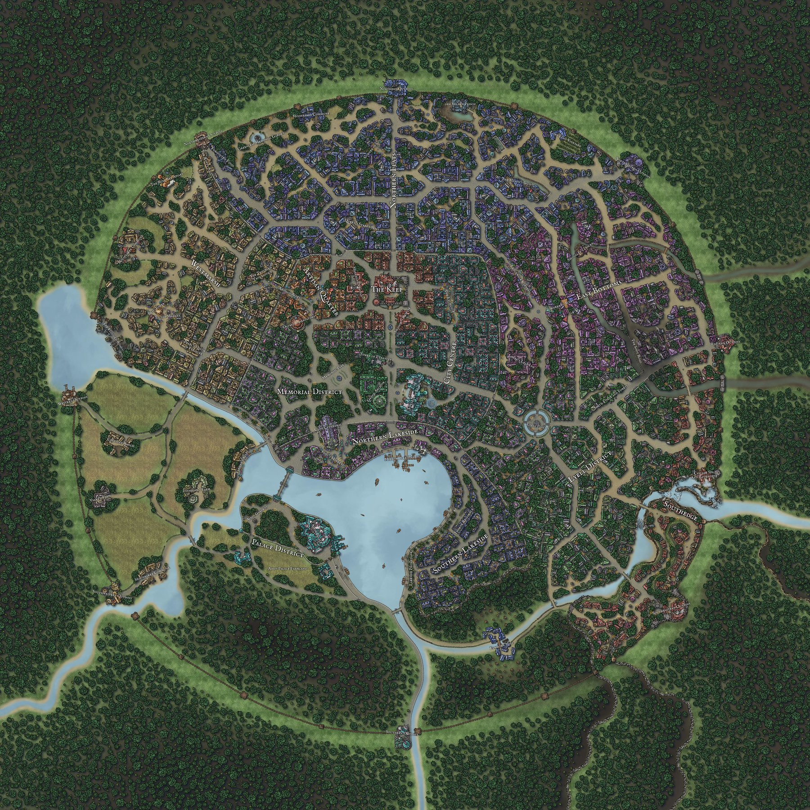

Country

## Litnich

 There is an underground community of sorcerers and wizards which still operate in Litnich. One of which is [Rhennel Liquelar][rhennel-liquelar], who was the one who tried to take out the [King][king-heriot]. She's the only person to evade the King's wrath and so he holds a heavy grudge against her.

### Map

 

### Districts

#### Palace District

 Obviously the home of the Palace. Backs onto a large area of woods, which seems unmonitored, but it actually has a large guard rotation.

**Airin Palace**
 Home of the [King Heriot][king-heriot] and his 3 children; Wilfred, Anastasia and Elizabeth. Nobody really gets in here unless they're a member of the royal staff.

**Airin Gardens**
 An area of conservation for almost extinct flora. You can commonly find the royal children running around here.

**Airin Palace Farmland**
 Mostly for show, as not many crops are grown here.

#### Southern Lakeside

 The more affluent live here. A common activity is leisurely walks down the promenade as it has nice views of the harbour without the smell of commoners.

**Lakeside Promenade**
 Full of finely dressed couples having after-dinner walks. Some street vendors patrol here trying to take advantage of ignorant rich people.

**Thorne Residence**
 Nigel Thorne is the owner of this residence, as well as the King's key advisor. The advisor always lives here, so the house comes with a speckled history.

#### Northern Lakeside

**Mirror Lake Harbour**
 The centre of all in and out trade in Litnich. You get a real mix of people coming through here.

**King's Market**
 A front for foreign trade most days, and a strange dark market on the night of a full moon (known as the 'Oscura Bazaar'). The King's market is the main way for those with enough Orens to get strange and mysterious goods. It's worth noting you can't find magical goods during the day due to the country-wide ban, but if you know the right places, you might be able to at the bazaar.

**Cyon Cathedral**
 Dedicated to Lathander, Cyon Cathedral considers itself open at any time to anyone who seeks advice in their life. They run services every Sunday evening to welcome in the new week. The Dean of the Cathedral is always a member of the King's Advisory.

#### Memorial District

 Home to the more academic side of Litnich. Holds large archives of the country's history.

**Memorial Park**
 Centred around a fountain, Memorial Park is one of the few places of beauty in Litnich open to all walks of life. 

**Grand Archive**
 Holds the history of the country (and skewed history of the continent), which is managed by a massive group of archivists and scholars. 

**Tower of Eternity**
 A locked tower made by the city's founder. It's been locked for eons and only rumours exist about it's true purpose. *DM note: It's the source of all magic for the continent, created by an incredible powerful wizard who ended up becoming a lich (check notes about the dinner party in H'oure)*

#### City Centre

#### The Keep

#### Artisan Quarter

#### Westmarsh

#### Lyell District

#### Southedge

 This isn't an official issue, but a larger population of dwarves have come to harm late at night. In fact, one ([Mordrom Forge][mordrom-forge]) owns the main bank and is the only place where you can exchange Hezenian Crowns for the generally accepted Orens.

#### East Bottoms

#### Northern Flats

 [mordrom-forge]: /DnD/npcs/trade/mordrom-forge
 [rhennel-liquelar]: /DnD/npcs/mages/rhennel-liquelar
 [king-heriot]: /DnD/npcs/royalty/heriot