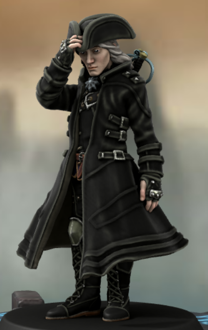

Adventurer
## Luceran Stillmoon

# The Basics

| ---------------- | --- |
| Name             | Luceran Stillmoon |
| Age              | 122 |
| Place of birth   | ? |
| Current location | Litnich |
| Nationality      | ? |
| Education        | Blood Hunter Order |
| Occupation       | Adventurer |
| Income           | Medium |

# Physical Appearance

| ----------------------------------------------------------------------------- | --- |
| Height                                                                        | 6'2 |
| Body type/build                                                               | Lanky |
| Skin tone                                                                     | Pale White |
| Hair (style & color)                                                          | Half black, half white |
| Eyes                                                                          | Inverted (black iris, white pupil) |
| Facial description                                                            | Delicate features |
| Prominent features or distinguishing marks. *E.g. tattoos, scars, birthmarks* | A mark on his neck with the name 'Berilac', Blood Fury tattoo covering his left arm which depicts dragons and hellfire, Covered in scars of various sizes |
| Preferred outfit                                                              | Black trenchcoat and tricorn hat |
| Level of grooming                                                             | Clean shaven |
| Mannerisms or gestures                                                        | Keeps to himself |
| Handwriting style *E.g. sloppy, neat, careful, unintelligible*                | Intricate |
| What's their health like?                                                     | In good health generally |
| How do they walk?                                                             | Silently |

# Speech & Communication

| --------------------------------------------------------------------------------- | --- |
| How do they talk (rapid, slow, measured, drawl, etc.)?                            | Measured with new people, passionatly with friends |
| Tone of voice (loud, quiet, harsh, etc.)                                          | Regular |
| What's the style of their speech (elevated, educated, peppered with slang, etc.)? | Blunt |
| Do they have an accent?                                                           | Yes, but no one can really place where it comes from |
| Posture (Stiff, military/Slouching/Casual & relaxed/‘Turtle,’ tired)              | Stiff |
| Favorite phrases                                                                  | *"..."* |
| How emotive are they?                                                             | Not particularly |

# The Past

| -------------------------------------------------------------- | --- |
| Name of hometown                                               | ? |
| Type of childhood (sheltered, neglected, etc.)                 | Abandoned, then neglected |
| Education level                                                | Surprisingly literate, but most skills were developed after childhood |
| Were they involved in organizations and clubs at school?       | Didn't attend school |
| Who were their role models growing up?                         | His mentor [Johan][johan-bloodmoon] |
| The greatest regret                                            | Not trying harder to get [Darian][darian-sunfire] to stay |
| The earliest memory                                            | Foggy |
| The happiest memory                                            | Kissing [Darian][darian-sunfire] after the war was over |
| The clearest memory                                            | The [Hunter's Bane][hunters-bane] |
| Describe the major turning points or “life beats” in childhood | Leaving the lab, the transformation, going through the [Hunter's Bane][hunters-bane] |
| Any criminal records?                                          | Bounty on his head in Anglethea due to being active in the failed attempt at the King's life, as well as practicing magic within Litnich |

# Family
What's their family's economic status?

When not out and about, he lives with the Bloodhunter Order in their compound in [Ayovik][ayovik]. The place is well kept due to the fact that anyone living there has to pitch in on the day-to-day running. 

How often do they see their family in a year?

He hasn't been home is a few years, due to his escapades with [Eclipsed Valor][eclipsed-valor].

| Father                                                  |   |
| ------------------------------------------------------- | --- |
| Age (if living)                                         |   |
| Occupation                                              |   |
| Briefly describe their relationship with your character | Absent |

| Mother                                                  |   |
| ------------------------------------------------------- | --- |
| Age (if living)                                         |   |
| Occupation                                              |   |
| Briefly describe their relationship with your character | Absent |

# External Relationships

| Closest Friends | Description |
| --------------- | ----------- |
| [Darian Sunfire][darian-sunfire]          |             |
| [Luna Silverleaf][luna-silverleaf]          |             |

| Other Significant Friends | Description |
| ------------------------- | ----------- |
| Name D                    |             |
| Name E                    |             |

| Enemies | Description |
| ------- | ----------- |
| [Berilac Winterthorn][berilac-winterthorn]  |             |
| [Arion Stormrider][arion-stormrider]  |             |

| How are they perceived by:      | Describe |
| ------------------------------- | -------- |
| Strangers                       | Focused, ignorant |
| Acquaintances                   | Quiet, determined |
| Colleagues                      | Determined |
| Authority                       | To be feared |
| Friends in their friend circles | Sentimental |
| Children                        | Boring |
| Opposite sex                    | Disinterested |
| Extended Family                 | Quiet, soft yet prickly |

| Who do they depend on for: | Name of the Character |
| -------------------------- | --------------------- |
| Practical advice           | [Johan Bloodmoon][johan-bloodmoon] |
| Mentoring                  | [Johan Bloodmoon][johan-bloodmoon] |
| A wingman                  |                       |
| Emotional support          |                       |
| Moral support              |                       |

Who is their significant other? Describe them.

[Darian Sunfire][darian-sunfire] is the closest he has to a significant other, but they split up due to [Darian][darian-sunfire] leaving for travel through the upper planes. Though Luceran tried to convince him to stay, [Darian][darian-sunfire] insisted that he come with him. This was turned down by [Darian's][darian-sunfire] deity, claiming that Luceran was not worthy to reach said planes.

# Psychology

| -------------------------------------------------------- | --- |
| Personality                                              | While he generally likes to keep to himself, Luceran will fiercly protect those he cares about, often with little concern for his own health. He won't take a job unless he agrees with the opinions of the employer and the possible outcomes, which has lead to some issues in the past. When he doesn't like someone, he despises them, often taking up huge parts of his mind until either something more important happens or he gives said person some sort of retribution. |
| Habits                                                   | Every morning, mirror permitting, he checks his appearance in the mirror, often touching significant scars. This is also a nervous twitch, and running his fingers over the scars on his arms tends to keep him grounded. |
| Ambition                                                 | He wants to track down [Berilac Winterthorn][berilac-winterthorn] and make him realise what a mistake he made messing with him. |
| Greatest fear                                            | Spies. He's incredibly paranoid that he's always being watched, so will always be on edge when in public. |
| Biggest secret                                           | It was him who folded and let his patron influence [Arion Stormrider][arion-stormrider], which lead to him breaking his oath, and eventually Eclipsed Valor splitting up. |
| How does this character get along with other characters? | When in a group of people that he respects, then he surprisingly emerges as a leader. Because of this, most people he knows like him, despite the fact he doesn't tend to realise. |

# The Present & Future
What is their story goal? *(answer in a single paragraph)*

Story motivation *(answer in a single paragraph)*

# Stat Block

[johan-bloodmoon]: /DnD/npcs/family/johan-bloodmoon
[darian-sunfire]: /DnD/npcs/adventurers/darian-sunfire
[hunters-bane]: /DnD/misc/hunters-bane
[ayovik]: /DnD/cities/ayovik
[eclipsed-valor]: /DnD/npcs/eclipsed-valor
[luna-silverleaf]: /DnD/npcs/adventurers/luna-silverleaf
[berilac-winterthorn]: /DnD/npcs/mages/berilac-winterthorn
[arion-stormrider]: /DnD/npcs/adventurers/arion-stormrider