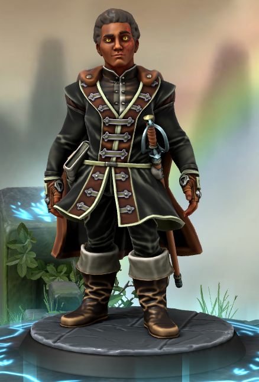

Bloodhunter
## Christopher Widdelin

# The Basics

| ---------------- | --- |
| Name             | Christopher Widdelin |
| Age              | 27 |
| Place of birth   | Ayovik |
| Current location | [Bloodhunter Order][bloodhunter-order], [Ayovik][ayovik] |
| Race             | Human |
| Education        | Blood Hunter Order |
| Occupation       | Order Higher Up, eldritch researcher |
| Income           | Medium |

[bloodhunter-order]: /DnD/npcs/bloodhunter-order
[ayovik]: /DnD/locations/ayovik

# Physical Appearance

| ----------------------------------------------------------------------------- | --- |
| Height                                                                        | 6ft |
| Body type/build                                                               | Broad, Full frame |
| Skin tone                                                                     | Deep brown |
| Hair (style & color)                                                          | Contained Curly |
| Eyes                                                                          | Yellow feline |
| Facial description                                                            | Very human |
| Prominent features or distinguishing marks. *E.g. tattoos, scars, birthmarks* | Thin scar across left side of his face |
| Preferred outfit                                                              | Order uniform |
| Level of grooming                                                             | Very well kept |
| Mannerisms or gestures                                                        | Clenches jaw when frustrated |
| Handwriting style *E.g. sloppy, neat, careful, unintelligible*                | Sloppy, doctor-like |
| What's their health like?                                                     | Impeccable |
| How do they walk?                                                             | Fast, purpose driven |

# Speech & Communication

| --------------------------------------------------------------------------------- | --- |
| How do they talk (rapid, slow, measured, drawl, etc.)?                            | Rapidly, with an assumption of high level knowledge |
| Tone of voice (loud, quiet, harsh, etc.)                                          | Loud |
| What's the style of their speech (elevated, educated, peppered with slang, etc.)? | Very educated |
| Do they have an accent?                                                           | Not a notable one |
| Posture (Stiff, military/Slouching/Casual & relaxed/‘Turtle,’ tired)              | Stiff |
| Favorite phrases                                                                  | "There's actually two schools of thought", "If you knew what I've heard..." |
| How emotive are they?                                                             | Not particularly, unless in heated discussion |

# The Past

| -------------------------------------------------------------- | --- |
| Name of hometown                                               | Ayovik |
| Type of childhood (sheltered, neglected, etc.)                 | Pampered |
| Education level                                                | High, mostly self-taught |
| Were they involved in organizations and clubs at school?       | Didn't attend school |
| The greatest regret                                            |  |
| The earliest memory                                            |   |
| The happiest memory                                            |   |
| The clearest memory                                            |   |
| Describe the major turning points or “life beats” in childhood |   |
| Any criminal records?                                          |   |

# Family
What's their family's economic status?

How often do they see their family in a year?

| Father                                                  |   |
| ------------------------------------------------------- | --- |
| Age (if living)                                         |   |
| Occupation                                              |   |
| Briefly describe their relationship with your character |   |

| Mother                                                  |   |
| ------------------------------------------------------- | --- |
| Age (if living)                                         |   |
| Occupation                                              |   |
| Briefly describe their relationship with your character |   |

# External Relationships

| Closest Friends | Description |
| --------------- | ----------- |
| Name A          |             |
| Name C          |             |

| Other Significant Friends | Description |
| ------------------------- | ----------- |
| Name D                    |             |
| Name E                    |             |

| Enemies | Description |
| ------- | ----------- |
| Name F  |             |
| Name G  |             |

| How are they perceived by:      | Describe |
| ------------------------------- | -------- |
| Strangers                       |          |
| Acquaintances                   |          |
| Colleagues                      |          |
| Authority                       |          |
| Friends in their friend circles |          |
| Children                        |          |
| Opposite sex                    |          |
| Extended Family                 |          |

| Who do they depend on for: | Name of the Character |
| -------------------------- | --------------------- |
| Practical advice           |                       |
| Mentoring                  |                       |
| A wingman                  |                       |
| Emotional support          |                       |
| Moral support              |                       |

Who is their significant other? Describe them.

# Psychology

| -------------------------------------------------------- | --- |
| Personality                                              |   |
| Habits                                                   |   |
| Ambition                                                 |   |
| Greatest fear                                            |   |
| Biggest secret                                           |   |
| How does this character get along with other characters? |   |

# The Present & Future
What is their story goal? *(answer in a single paragraph)*

Story motivation *(answer in a single paragraph)*

# Stat Block

